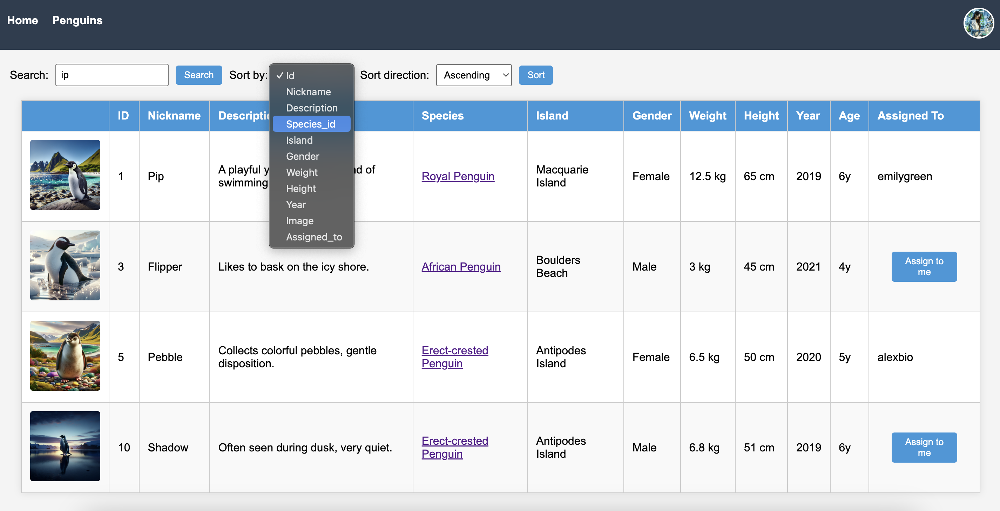
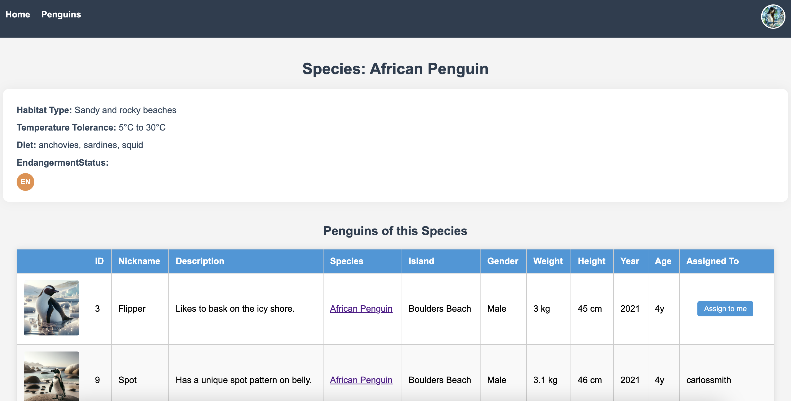
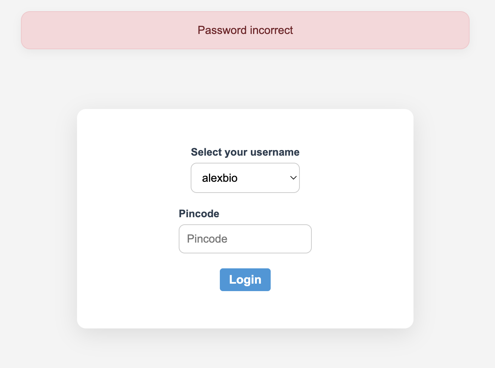
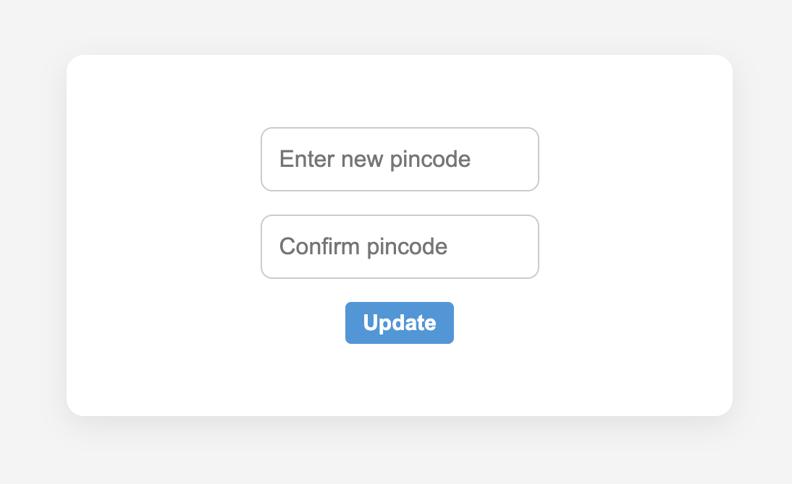

# Pinguin Researcher App

In deze opdracht gaan we een applicatie maken voor het beheren van pinguin onderzoek. De applicatie maakt gebruik van een mongodb database om de gegevens van de pinguins, soorten en onderzoekers op te slaan. We gaan gebruik maken van Express, TypeScript en EJS om de applicatie te bouwen.

## 🗃️ Startbestanden

Je begint van een file [starter.zip](./starter.zip). Deze bevat al een basis structuur van de applicatie. Alle HTML bestanden zijn al omgezet naar EJS templates en de nodige dependencies zijn al toegevoegd aan het project. 

Unzip alle bestanden van de zip file en installeer de nodige dependencies met `npm install`. Lees eerst de code goed door dat je de volledige structuur van de applicatie begrijpt.

## 🛠️ Opdracht

Je begint met een start project waarin de basis van de applicatie is uitgewerkt. Niet alle knoppen en delen van de applicatie zijn belangrijk voor de opgave. 

### Algemene vereisten

Hier een aantal algemene vereisten die je moet volgen. Doe je dit niet dan krijg je minpunten:

- [ ] Gebruik overal de juiste interfaces/types. Dus geen `any` gebruiken.
- [ ] Gebruik de juiste array methodes indien dit gevraagd wordt. Als er geen specifieke methode wordt gevraagd, mag je zelf kiezen welke methode je gebruikt.
- [ ] node_modules folder mag niet geüpload worden.

### Routers

Er staan in dit project een aantal routers die al voor jou zijn aangemaakt. Momenteel bevatten deze al wel alle routes die gaan gebruikt worden, maar zijn deze nog niet geimplementeerd. Zorg dat de volgende routers beschikbaar zijn op de volgende routes:
- [ ] `authRouter` op `/`. 
- [ ] `homeRouter` op `/`. 
- [ ] `penguinRouter` op `/penguins`. 
- [ ] `speciesRouter` op `/species`.
- [ ] `researcherRouter` op `/researchers`.

Als je dit gedaan hebt kan je de applicatie starten met `npm start` en zou je de home pagina moeten kunnen zien op `http://localhost:3000/`.

### Database setup

Je koppelt de applicatie aan een eigen lege MongoDB Atlas database.

In dit project is er al een `database.ts` bestand aangemaakt. Het bevat al een aantal functies die je kan gebruiken om de database te benaderen. Er is al een `seedDatabase` functie aangemaakt die op zijn beurt de `seedResearchers`, `seedSpecies` en `seedPenguins` functies aanroept. Deze functies zijn nog niet geimplementeerd, maar je kan deze wel al zien in het bestand.

#### Researchers

De applicatie werkt met `Researchers`. Dit zijn de onderzoekers die de pinguins onderzoeken. Ze hebben kunnen inloggen aan de hand van hun username en pincode. De data van de researchers moet worden ingelezen vanuit een externe API (https://raw.githubusercontent.com/similonap/json/refs/heads/master/penguins/researchers.json) en vervolgens worden opgeslagen in de database. Uiteraard moeten de pincodes worden gehashed voordat deze worden opgeslagen.

- [ ] Lees de data van de researchers in vanuit de externe API in de `seedResearchers` functie in `database.ts`.
- [ ] Zorg dat alle pincodes van de researchers worden gehashed.
- [ ] Sla de researchers op in een `researchersCollection` in de database.
- [ ] Zorg ervoor dat de researchers alleen worden opgeslagen als ze nog niet in de database staan. 

#### Species

Elke pinguin hoort bij een soort. Deze soorten moeten ook worden ingelezen vanuit een externe API (https://raw.githubusercontent.com/similonap/json/refs/heads/master/penguins/species.json) en vervolgens worden opgeslagen in de database.

- [ ] Lees de data van de species in vanuit de externe API in de `seedSpecies` functie in `database.ts`.
- [ ] Sla de species op in een `speciesCollection` in de database.
- [ ] Zorg ervoor dat de species alleen worden opgeslagen als ze nog niet in de database staan.

#### Pinguins

De pinguins moeten ook worden ingelezen vanuit een externe API (https://raw.githubusercontent.com/similonap/json/refs/heads/master/penguins/penguins.json) en vervolgens worden opgeslagen in de database. Elke pinguin hoort bij een soort en heeft een onderzoeker die deze heeft onderzocht. Deze informatie moet ook worden opgeslagen in de database.

- [ ] Lees de data van de pinguins in vanuit de externe API in de `seedPenguins` functie in `database.ts`.
- [ ] Zoek voor elke pinguin de soort op in de `speciesCollection` en sla deze op in de pinguin als een sub object. Elke pinguin moet dus een species object bevatten met de soort informatie.
- [ ] Sla de pinguins op in een `penguinsCollection` in de database.
- [ ] Zorg ervoor dat de pinguins alleen worden opgeslagen als ze nog niet in de database staan.

### Pinguin overzicht

Op de /penguins pagina moet een overzicht komen van alle pinguins. Momenteel is dit helemaal hard gecodeerd in HTML, maar dit moet natuurlijk dynamisch worden gemaakt. 

- [ ] Pas de `getAllPenguins` functie aan in de `database.ts` zodat deze alle pinguins teruggeeft uit de database afhankelijk van de sortField, sortDirection en de q parameter. 
- [ ] Pas de router aan zodat deze de pinguins ophaalt uit de database en deze doorgeeft aan de view.
- [ ] Pas de view aan zodat de pinguins worden weergegeven in een tabel. 
- [ ] Geef de `calculatePenguinAge` functie door aan de view zodat deze gebruikt kan worden om de leeftijd van de pinguins te berekenen. Deze functie is al aangemaakt in de `utils.ts` file.
- [ ] Zorg ervoor dat de pinguins kunnen worden gesorteerd op verschillende velden. De velden waarop je kan sorteren kan je vinden in de `SORT_FIELDS` constante. De sorteerrichting kan worden bepaald door de `sortDirection` query parameter op `asc` of `desc` te zetten. De standaard sortering is op `id` en `asc`.
- [ ] Zorg ervoor dat de pinguins kunnen worden gefilterd op basis van de `q` query parameter. Deze parameter kan worden gebruikt om te zoeken op de nickname van de pinguin. Er moet worden gezocht in de `nickname`, `description`, `species`, `island` en `assigned_to` velden van de pinguin.
- [ ] Als een pinguin is toegewezen aan een onderzoeker, moet de naam van de onderzoeker worden weergegeven in de tabel. Als de pinguin nog niet is toegewezen, moet er een knop komen om de pinguin toe te wijzen aan de ingelogde onderzoeker. Deze knop moet een POST request sturen naar de `/penguins/:id/assign` route. Momenteel hoef je alleen nog maar een placeholder te maken voor deze knop, de functionaliteit komt later.
- [ ] Als je op de soort (species) van een pinguin klikt, moet je naar de detail pagina van de soort gaan. Deze pagina moet nog worden gemaakt, maar je kan alvast de link al aanmaken naar de soort detail pagina. De link moet er als volgt uitzien: `/species/:id`, waarbij `id` de id van de soort is.

### Soort (species) detail pagina

Op de soort detail pagina moet de informatie van de soort worden weergegeven. 

- [ ] Implementeer de `getSpeciesById` functie in de `database.ts` zodat deze de soort ophaalt uit de database op basis van de id.
- [ ] Implementeer de `getPenguinsBySpecies` functie in de `database.ts` zodat deze alle pinguins ophaalt die bij de soort horen.
- [ ] Pas de router aan zodat deze de soort ophaalt uit de database en deze doorgeeft aan de view.
- [ ] Als de species id niet bestaat, moet er een 404 error worden gegeven (mag gewoon de tekst "Species not found" zijn).
- [ ] Pas de view aan zodat de soort informatie wordt weergegeven. Het habitat type, de temperatuur tolerantie (de minimum en maximum temperatuur), het dieet en de endangerment status moeten worden weergegeven. Om de badge van de endangerment status te tonen, kan je de `status` class gebruiken. Deze class is al aangemaakt in de `styles.css` file. De class is de string `status-` gevolgd door de endangerment status van de soort. Bv `class="status status-NT"` voor de vulnerable status.
- [ ] Onderaan de pagina staat een tabel met alle pinguins die bij de soort horen. Dit is dezelfde tabel als op de `/penguins` pagina. Zorg dat deze in een partial wordt gezet zodat je deze kan hergebruiken op de soort detail pagina.

### Login functionaliteit

De onderzoeker (researcher) moet kunnen inloggen met zijn username en pincode. We gaan voor het login systeem gebruik maken van sessions.

- [ ] Implementeer de `login` functie in de `database.ts` zodat deze de onderzoeker ophaalt uit de database op basis van de username en pincode. De pincode moet worden gehashed voordat deze wordt vergeleken met de opgeslagen pincode. Als de onderzoeker niet bestaat of de pincode incorrect is, moet er een error worden gegooid.
- [ ] Implementeer de `getAllResearchers` functie in de `database.ts` zodat deze alle onderzoekers ophaalt uit de database. 
- [ ] Gebruik de `getAllResearchers` functie in de `authRouter` om de onderzoekers op te halen en deze door te geven aan de view zodat deze kunnen worden weergegeven in de login pagina (in de select box).
- [ ] Implementeer de login functionaliteit in de `authRouter`. Als de login succesvol is, moet de onderzoeker worden opgeslagen in de session en moet er een success message worden weergegeven. Als de login niet succesvol is, moet er een error message worden weergegeven. Gebruik hiervoor flash messages.
- [ ] Implementeer de logout functionaliteit in de `authRouter`. Als de logout succesvol is, moet er een success message worden weergegeven. Gebruik hiervoor flash messages.
- [ ] Zorg ervoor dat de onderzoeker moet ingelogd zijn om alle pagina's te kunnen bekijken. Als de onderzoeker niet is ingelogd, moet hij worden doorgestuurd naar de login pagina. 
- [ ] Toon de naam van de ingelogde gebruiker in de home pagina.

### Toewijzen van pinguins aan onderzoekers

- [ ] Implementeer de `assignPenguinToResearcher` functie in de `database.ts` zodat deze de pinguin toewijst aan de onderzoeker.  De functie moet de pinguin ophalen uit de database op basis van de id en vervolgens de onderzoeker toewijzen aan de pinguin. De onderzoeker wordt doorgegeven als een string (de username van de onderzoeker). Als de pinguin niet bestaat, moet er een error worden gegooid (en moet er een 404 error worden getoond "Penguin not found").
- [ ] Implementeer de `/penguins/:id/assign` route in de `penguinRouter`. Deze route moet de `assignPenguinToResearcher` functie aanroepen en de pinguin toewijzen aan de ingelogde onderzoeker. De username van de ingelogde onderzoeker kan worden opgehaald uit de session.

### Pincode wijzigen

- [ ] Implementeer de `updateResearcher` functie in de `database.ts` zodat deze de pincode van de onderzoeker wijzigt. 
- [ ] Implementeer de `/researcher/:username` route in de `researcherRouter`. Deze pagina toont een formulier waar de onderzoeker zijn pincode kan wijzigen. 
- [ ] Implementeer de `/researcher/:username/update` route in de `researcherRouter`. Deze route moet de `updateResearcher` functie aanroepen en de pincode van de onderzoeker wijzigen. Als de pincode en de bevestiging niet overeenkomen, moet er een error message worden weergegeven. Als de pincode succesvol is gewijzigd, moet er een success message worden weergegeven.

### Doorsturen

Als je klaar bent dan verwijder je eerst de `node_modules` folder en maak je een zip van de volledige folder. Deze zip upload je naar toets.ap.be.

Opgepast: Als je de `node_modules` folder niet verwijderd, dan krijg je minpunten.